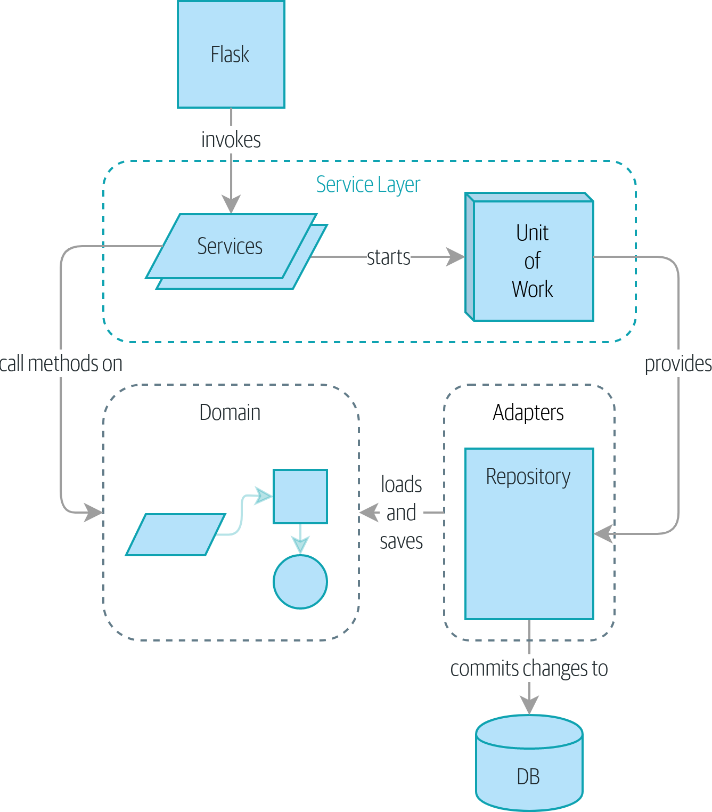
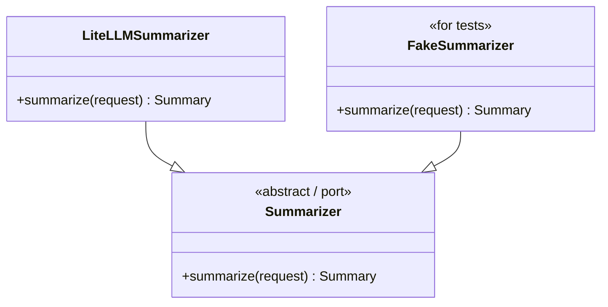

# Architecture Concepts

A working glossary of the terms from "Architecture Patterns with Python" (Cosmic Python) and DDD, in plain English. Taught in dependency order — each concept builds on the previous.

## Quick-reference diagram

The whole picture in one shot.

### Runtime flow — what calls what



*Figure from *Architecture Patterns with Python* by Harry Percival & Bob Gregory (O'Reilly).*

**How to read it:** a request comes in at the top, drops into a service, the service starts a Unit of Work and calls methods on the Domain. The UoW provides repositories (and other adapters) that load/save Domain entities. Adapters talk to external systems. Nothing below ever imports anything above it.

**Two mental upgrades to apply as you read it:**

1. The "Adapters" box only shows `Repository` because the book's example only needs storage. Your apps have more — `Summarizer`, `Notifier`, `AuthProvider`, `PaymentAdapter`. Same shape, repeated per external system.
2. The book lumps Port + Adapter into one box. They're actually two things — see the next diagram.

### Each "Adapter" box, expanded

The diagram lumps Port + Adapter into one box. They're actually two things:



The same shape applies to every external system: Repository, AuthProvider, Notifier, PaymentAdapter. **Port is the *shape of the hole*; adapter is the *plug* that fits it.**

### The dependency rule (the only thing you must get right)

```
domain      ←  imports nothing external
ports       ←  imports domain only
adapters    ←  imports domain, ports, external SDKs
services    ←  imports domain, ports
entrypoints ←  imports services, schemas
bootstrap   ←  imports everything (the wiring)
```

Arrows always point **inward toward the domain**. If `domain/lists.py` ever imports from `adapters/` or `entrypoints/`, the architecture is broken. A `grep` in CI is enough to enforce this.

## Reading order — the core five

Read these in order. Each one assumes the previous.

1. [Domain](./domain.md) — what your app is fundamentally about
2. [Repository](./repository.md) — the one place that knows how to load and save domain entities
3. [Service](./service.md) — the function that runs one use case from start to finish
4. [Adapter](./adapter.md) — the generalization of Repository (a swappable seam for *any* external system, not just storage)
5. [Unit of Work](./unit-of-work.md) — ties Services and Repositories together at transaction boundaries (one logical operation = one commit/rollback)

### Putting it on disk

- [Project Structure](./project-structure.md) — what the directory layout looks like once you apply the core five (FastAPI/Python, anchored to hypedar/tytona)
- [Testing](./testing.md) — the test pyramid, doubles vs mocks, pytest mechanics, and why the architecture above makes good tests cheap
- [Performance & Benchmarking](./performance.md) — *external tooling*: five questions, five tools (profiler / tracer / load test / monitor / query analysis), load shapes, the four prod failure modes
- [Code-Level Instrumentation](./instrumentation.md) — *what to wire into your code*: custom spans, health checks, metrics, pytest-benchmark, latency budgets — companion to performance.md
- [Logging & Observability](./logging.md) — structured logging with structlog, correlation IDs, ASGI middleware (not HTTP), what to log / never log, the FastAPI 2026 stack

### Why this order

- **Repository** only makes sense once you know what a *Domain* is (because a Repository is "a thing that stores Domain entities").
- **Service** only makes sense once you have a Domain *and* a Repository (because a Service orchestrates between them).
- **Adapter** is a generalization of the Repository pattern — easier once you've seen one specific case.
- **Unit of Work** is the last piece — it ties Services and Repositories together at transaction boundaries.

Reading them out of order is how the jargon stays confusing.

## After the core five — the rest of Part I

Once you have the core five, these are the remaining Part I chapters from *Architecture Patterns with Python*. Read them **in this order, and only after** you have the core five down — they assume the vocabulary.

6. **Coupling and Abstractions** (book ch. 3) — the philosophical spine of the whole book. Why the patterns exist at all. *"Depend on abstractions you control, not on external libraries."* Often the chapter that makes the rest *click*.
7. **TDD in High Gear and Low Gear** (book ch. 5) — when to test the domain (fast, lots of tests) vs. the service (slower, fewer) vs. the edges (slowest, fewest). The test pyramid for layered apps.
8. **Aggregates and Consistency Boundaries** (book ch. 7) — the "which entity is in charge?" question. When a `List` has many `Items`, is `Item` an entity in its own right or just part of `List`? This is the chapter that explains why you have *one repository per aggregate, not per table.*

The above three are the rest of Part I. Part II (events, message bus, CQRS) is intentionally not on this list — most apps don't need it until they have multiple services or hard read/write asymmetry. Don't read it just because it exists.

## Vocabulary cheat-sheet

If you're re-reading the book, these are the terms it uses without warming up. Keep this list nearby.

| Term | Plain English |
|---|---|
| **Domain** | What your app is fundamentally about, in business terms |
| **Domain model** | The code (entities + rules) that represents the domain |
| **Entity** | A "thing" in the domain that has identity and changes over time (`List`, `Conversation`) |
| **Value object** | A "thing" defined by its values, not its identity (`Money`, `EmailAddress`) — usually immutable |
| **Aggregate** | A cluster of entities treated as one unit, with one "root" entity in charge |
| **Aggregate root** | The entity that's the entry point to the aggregate (the only one repos return) |
| **Ubiquitous language** | The shared vocabulary between devs and business people, encoded in code |
| **Persistence ignorance** | The domain doesn't know how it's stored |
| **Repository** | Collection-shaped abstraction over storage — `add()`, `get()` |
| **Application service** | A use-case function: load → delegate → save |
| **Domain service** | A piece of biz logic that doesn't fit on a single entity (rare) |
| **Port** | An interface the domain depends on (e.g., `ListRepository` ABC) |
| **Adapter** | A concrete implementation of a port (e.g., `SqlAlchemyListRepository`) |
| **Unit of Work** | An object that owns a transaction; commits or rolls back one logical operation |
| **Onion / Hexagonal / Ports-and-Adapters / Clean architecture** | All names for "domain in the middle, infrastructure on the outside, dependencies point inward" |
| **DIP (Dependency Inversion Principle)** | High-level modules (domain) shouldn't depend on low-level ones (DB, APIs); both depend on abstractions |
| **Anemic domain model** | Entities that are just data, with all logic in services. Common, often a smell |
| **Rich domain model** | Entities that have behavior + rules on themselves. What the book argues for |

## How each doc is structured

Every concept doc follows the same shape:

1. **One-line definition**
2. **Real examples** — anchored to projects you know (tytona, hypedar, requests)
3. **What's in / what's out** — clear boundary
4. **The trap** — the mistake most people make with this concept
5. **How to spot it in your code** — concrete check using your existing projects
6. **Self-check** — questions to test understanding before moving on
7. **Things to steal** — the takeaways worth keeping

If you can answer the self-check questions without looking, you've got that concept. Move on.
